# DriveLoom

[Deutsch](#installation) · [English](#english)

**DriveLoom verbindet Fahrzeugdaten aus Home Assistant mit Verbrauchsanalyse, GPS-Fahrten und einer interaktiven Karte.** Auf derselben Karte kannst du Ladestationen und andere POIs recherchieren, Ziele planen und eigene Reisen mit Notizen und Dokumenten archivieren. Die Integration verwaltet ihre Daten in Home Assistant.
Die aktuelle Version ist **0.2.0**. DriveLoom enthält eine Fahrzeug- und Verbrauchsübersicht sowie eine Fahrzeugkarte für GPS, POIs, Routen und Reisen.

[☕ DriveLoom auf Ko-fi unterstützen](https://ko-fi.com/lemuba20013)

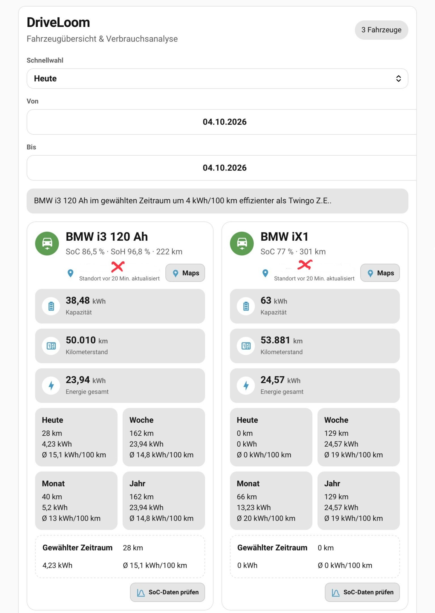

## Installation

### Voraussetzungen

- Home Assistant **2026.1.0 oder neuer**.
- Vorhandene Home-Assistant-Sensoren für **Ladezustand (SoC)** und **Kilometerstand** je Fahrzeug. Die nutzbare Batteriekapazität wird ebenfalls benötigt: als Sensor bei den BMW-Profilen oder als Sensor beziehungsweise fester Wert beim generischen BEV.
- Optional: Reichweite, SoH und GPS-Breitengrad/-Längengrad. Die beiden GPS-Sensoren müssen gemeinsam konfiguriert werden.
- Für **Open Charge Map** ist bei aktivierter Quelle ein eigener API-Schlüssel erforderlich. Der Schlüssel bleibt im Home-Assistant-Backend. **OCPDB · MobiData BW** benötigt keinen Open-Charge-Map-Schlüssel.

### HACS als benutzerdefiniertes Repository

1. **HACS** öffnen und im Menü mit den drei Punkten **Benutzerdefinierte Repositories** wählen.
2. `https://github.com/lemuba/DriveLoom` eintragen, als Typ **Integration** wählen und hinzufügen.
3. **DriveLoom** in HACS öffnen und die aktuelle Version herunterladen.
4. **Home Assistant neu starten**. Unter **Einstellungen → Geräte & Dienste → Integration hinzufügen** nach **DriveLoom** suchen und ein Fahrzeug einrichten.

HACS verwaltet die Integrationsdateien. Im Lovelace-Storage-Modus registriert DriveLoom seine Dashboard-Ressource beim Start automatisch. Für den YAML-Ressourcenmodus ist zusätzlich der unten genannte Eintrag nötig. Allgemeine Hinweise: [HACS – Custom Repositories](https://www.hacs.dev/docs/faq/custom_repositories/).

### Manuell installieren

1. Den vollständigen Ordner `custom_components/driveloom` nach `<HA-Konfigurationsverzeichnis>/custom_components/driveloom` kopieren. Die Unterordner einschließlich `frontend/`, `brand/` und `translations/` erhalten.
2. Bei einem Update alle Dateien der neuen Version übernehmen. Alte versionierte `driveloom-card-*.js` im Zielordner entfernen, sofern sie nicht mehr zur installierten Version gehören.
3. Home Assistant neu starten und **DriveLoom** wie oben unter **Einstellungen → Geräte & Dienste** hinzufügen.

### Fahrzeug und Dashboard einrichten

Zunächst **BEV** wählen. Danach Namen, SoC-Sensor und Kilometerstand-Sensor zuordnen. Bei den BMW-Profilen den Sensor für die **nutzbare Gesamtkapazität** der Hochvoltbatterie angeben, nicht den momentanen Energieinhalt. Für BEV kann alternativ eine feste nutzbare Kapazität in kWh eingetragen werden. Reichweite, SoH und GPS-Sensoren sind abhängig vom Fahrzeugprofil optional. Weitere Fahrzeuge werden über **Gerät hinzufügen** eingerichtet; vorhandene lassen sich später neu konfigurieren.

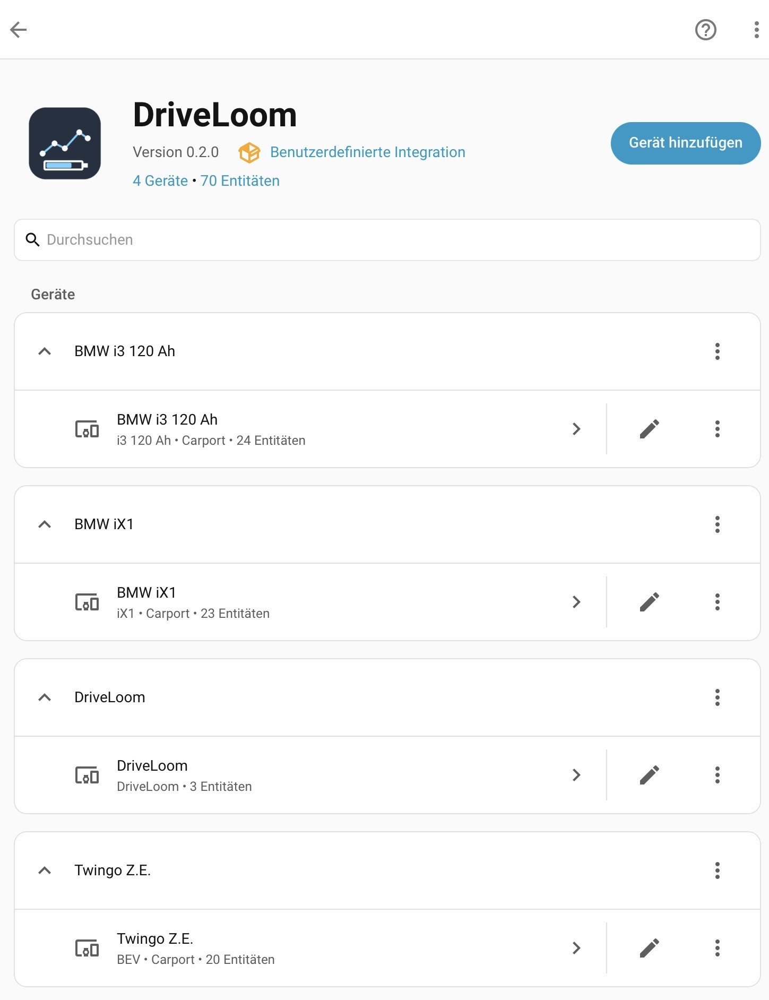

<details><summary>Beispiel: Zuordnung der Fahrzeugsensoren</summary>

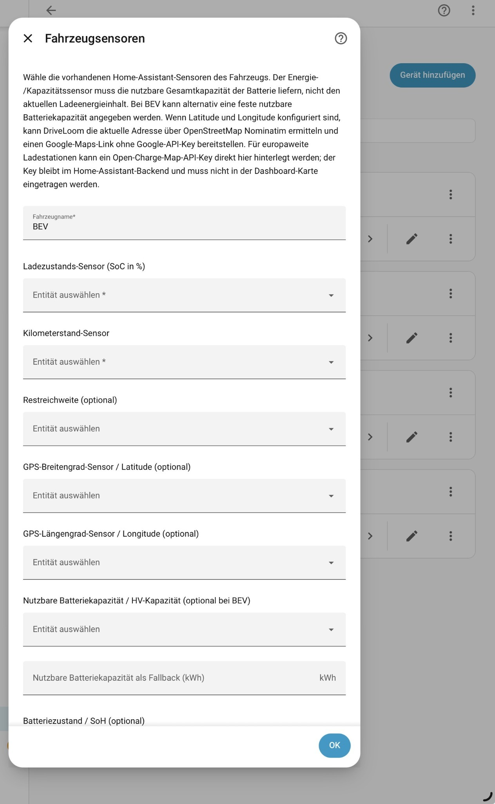

</details>

Füge anschließend in einem Dashboard eine **Manuelle Karte** mit einem der folgenden Inhalte hinzu:

```yaml
type: custom:driveloom-card
```

```yaml
type: custom:driveloom-map-card
```

Bei Lovelace im **YAML-Ressourcenmodus** zusätzlich diese JavaScript-Modulressource eintragen:

```yaml
resources:
  - url: /driveloom/driveloom-card-0.2.0.js?v=0.2.0
    type: module
```

Bei einem Update die Dashboard-Seite neu laden. Falls noch eine ältere Version angezeigt wird, Browser- oder App-Cache sowie den Ressourcenpfad prüfen.

## Funktionsumfang

### Fahrzeugübersicht und Verbrauch

Die Analysekarte zeigt Fahrzeugzustand, SoC, Reichweite, Kilometerstand und Kapazität sowie Verbrauch und Fahrleistung für heute, Woche, Monat, Jahr und einen selbst gewählten Zeitraum. Ein gemeinsamer Datumsbereich erlaubt den Vergleich mehrerer Fahrzeuge. Fahrten- und Verbrauchsanalysen verwenden die von DriveLoom gespeicherten Daten; fehlende Werte werden nicht als gemessene Nullen ausgegeben. Werkzeuge zur Prüfung und Reparatur der SoC-Daten sind in der Übersicht erreichbar.

### Fahrzeugkarte und Kartensteuerung

Die Karte zeigt mehrere Fahrzeuge mit ein- und ausblendbaren Markern und, soweit Daten vorhanden sind, deren Reichweite. Zur Wahl stehen **OSM, OSM+, Topo, Satellit und 3D**. In 3D lassen sich unter anderem Neigung, Drehung und Geländehöhe einstellen. **GPS-Follow** hält das gewählte Fahrzeug im Blick und kann nach zuverlässigen aufeinanderfolgenden Positionspunkten die Fahrtrichtung nach oben drehen. Eine Fahransicht blendet die obere Bedienleiste aus und gibt der Karte mehr Platz.

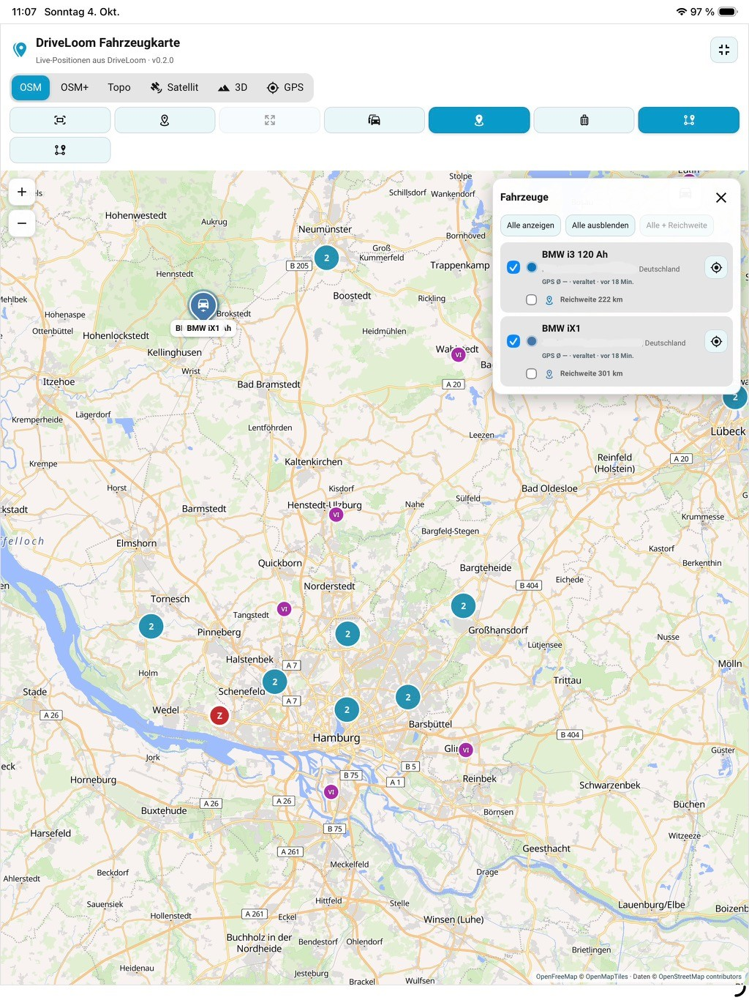

Kartenposition, Zoom und ein offenes POI-Panel werden nach einem App-Wechsel oder einem Neuaufbau der Karte wiederhergestellt. Bei aktivem GPS-Follow hat die Fahrzeugkamera Vorrang. Ein geöffnetes POI-Popup wird nach vollständigem Neuladen nicht selbstständig wieder geöffnet.

### GPS-Aufzeichnung und Fahrten

Unter **Tracking/GPS-Historie** kannst du die Aufzeichnung pro Fahrzeug einschalten, Zeiträume und Darstellungen wählen, Fahrten in Ordner einordnen und Tracks auf der Karte betrachten. Die Ansicht bietet unter anderem farbige Geschwindigkeitsabschnitte, Legende, Fahrtenauswahl, GPX-Export, Wiedergabe und einen manuellen Import älterer GPS-Daten aus dem Home-Assistant-Recorder. Fahrten lassen sich einzeln oder gesammelt bearbeiten.

Neben den konfigurierten Fahrzeugsensoren sind **externe GPS-Quellen** möglich, etwa eine Position aus der iPhone-Companion-App. Fahrten können damit manuell gestartet werden. Pro Fahrzeug kann alternativ ein automatischer Auslöser verwendet werden:

- ein vorhandener Sensor mit einer bestimmten WLAN-/CarPlay-**SSID**; oder
- eine vorhandene Home-Assistant-Entität `binary_sensor.*` mit `on` für verbunden und `off` für getrennt.

Bei Unterbrechung wird die automatische Fahrt pausiert; nach Wiederverbindung kann sie fortgesetzt werden. Nach längerem Getrenntsein endet sie. Ein unbekannter oder nicht verfügbarer Binärsensor zählt als getrennt. Optional kann DriveLoom während der aktiven Fahrt Standortaktualisierungen der iPhone-Companion-App anfordern. DriveLoom **erzeugt den Binärsensor nicht selbst**. Bereits gespeicherte SSID-Regeln bleiben nutzbar.

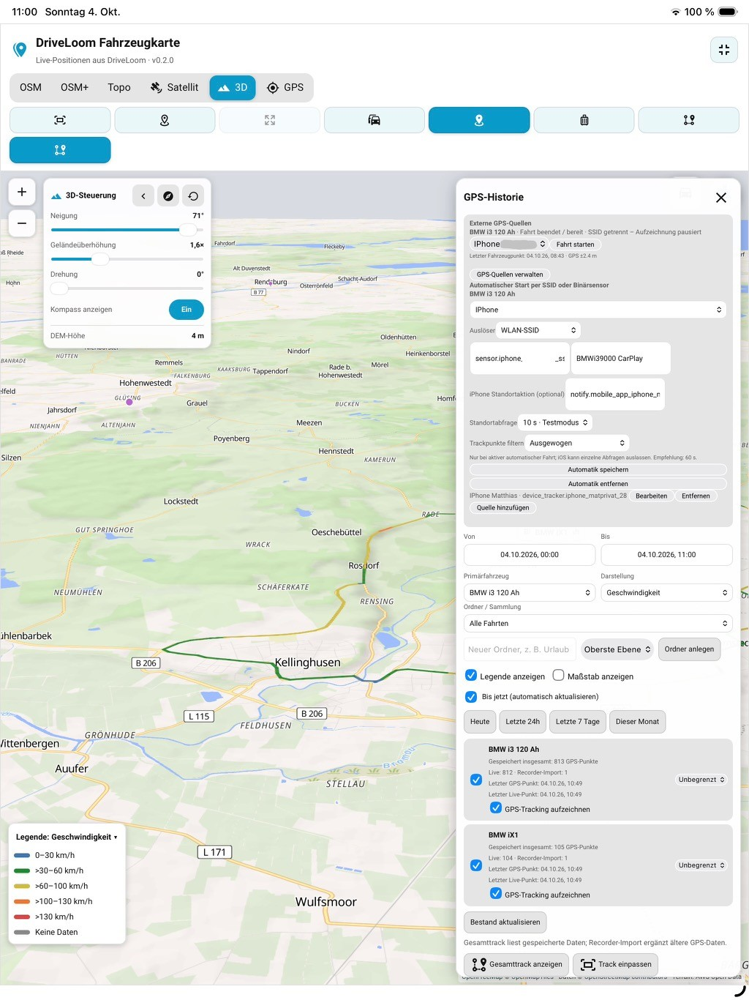

<details><summary>Weitere Ansicht: aufgezeichnete Strecke und Fahrtenliste</summary>

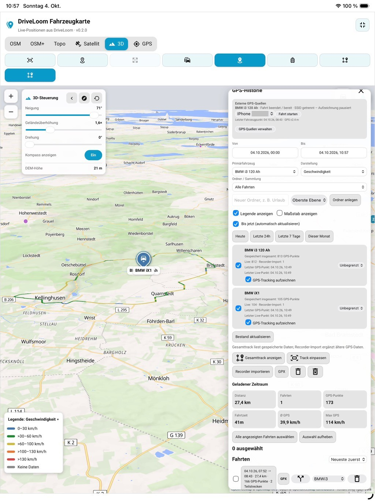

</details>

### POI-Suche, Filter und Vorlagen

Im POI-Panel kannst du Kategorien, Suchbegriffe für allgemeine POIs und getrennte Filter für Ladestationen kombinieren. Als Suchzentrum dienen das **aktuelle Fahrzeug** oder die **Kartenmitte**. Filter und Suchradius lassen sich in globalen POI-Vorlagen speichern. POI-Marker werden auf der Karte zusammengefasst und bei näherem Zoom einzeln sichtbar.

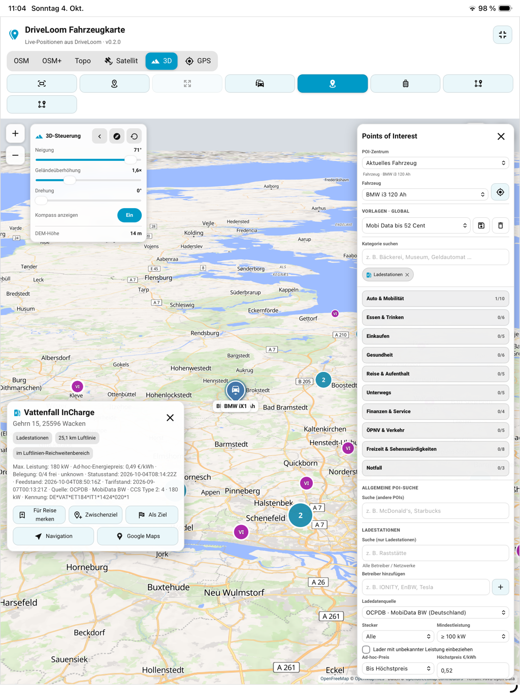

<details><summary>Vorlagen auf dem Smartphone wählen</summary>

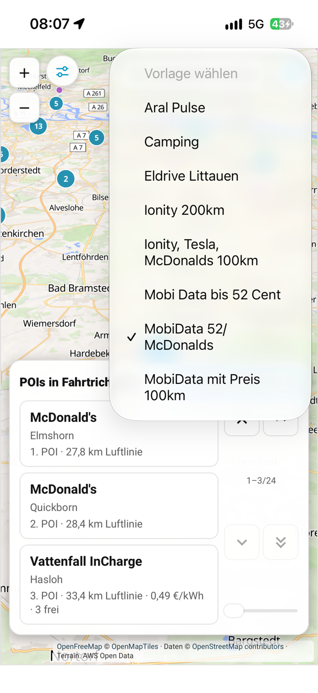

</details>

Mit **GPS-Follow** zeigt eine Kachel auf Wunsch **ein bis drei vorausliegende POIs** aus den geladenen und gefilterten Ergebnissen. Eine Vorlage kann direkt in der Kachel gewechselt werden. Pfeile, Doppelpfeile, Wischen, Mausrad und ein Positionsregler blättern durch weitere Treffer. Ein Tipp auf einen POI zentriert ihn beim einstellbaren Detailzoom; danach kannst du zur Fahrzeugansicht zurückkehren oder die Navigation an Google Maps übergeben. Der **POI-Hinweis-Test** zeigt die Auswahl auch im Stand. Die angezeigten Entfernungen sind Luftlinien, keine Straßenentfernungen.

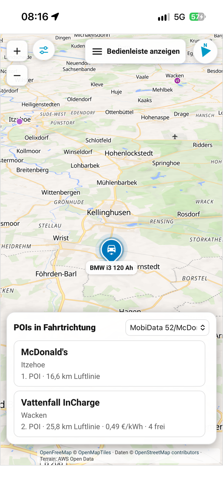

<details><summary>Weitere mobile Ansichten: Vorlagenwechsel und POI-Vorschau</summary>

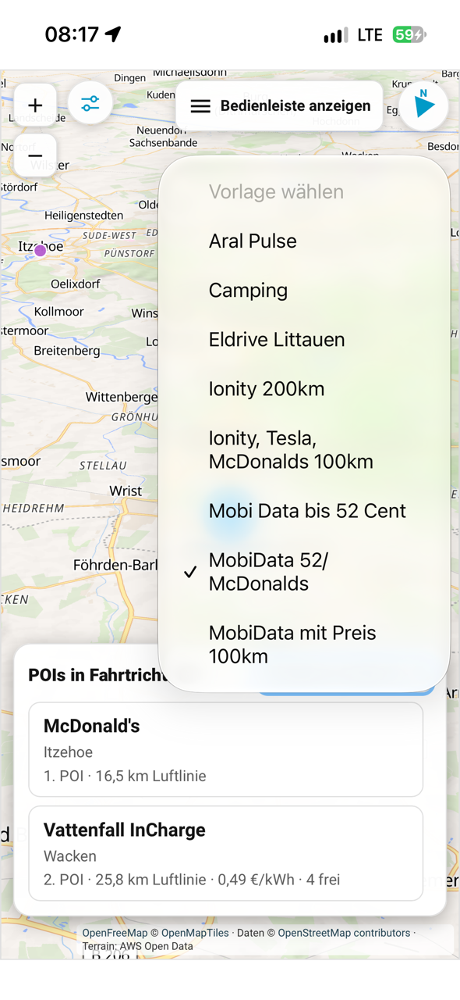
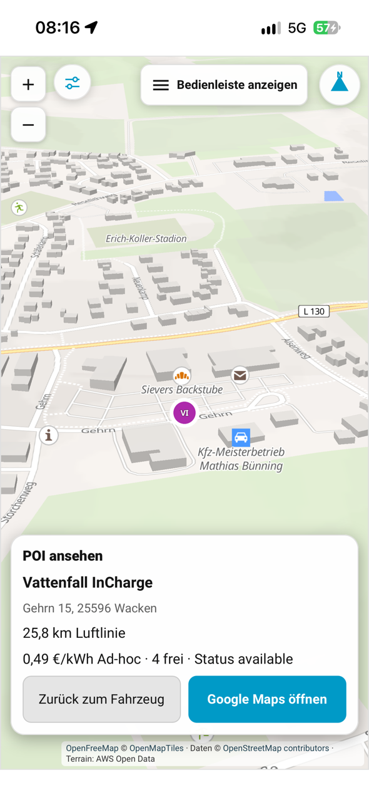

</details>

### Ladestationen, Preise und Verfügbarkeit

Für Ladepunkte kannst du zwischen **Open Charge Map** und **OCPDB · MobiData BW (Deutschland)** wählen. Je nach Quelle stehen Betreiber, Steckertyp, Mindestleistung, bekannter Ad-hoc-Preis, Höchstpreis pro kWh und die Mindestzahl freier Ladepunkte als Filter bereit. Diese Einstellungen können Teil einer globalen POI-Vorlage sein und werden auch für POIs in GPS-Follow verwendet.

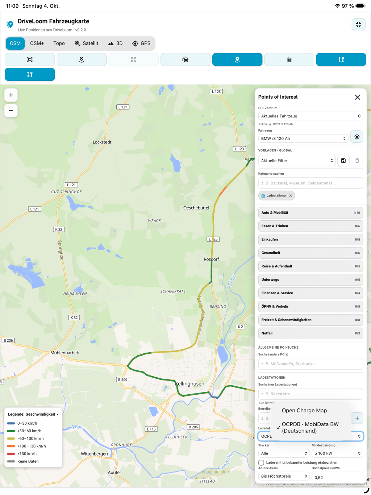

OCPDB-Preise zeigt DriveLoom nur an, wenn ein lesbarer Tarif dem betreffenden Stecker und Ladepunkt zugeordnet werden kann. Zusätzliche Zeitgebühren werden gesondert gekennzeichnet. Veraltete oder fehlende Statusmeldungen zählen als **unbekannt** und nicht als frei. Ein Ladepunkt-Popup stellt verfügbare Betreiber- und Stationslinks getrennt dar. **Preis, Status und weitere Gebühren vor dem Laden beim Betreiber oder am Ladepunkt prüfen.**

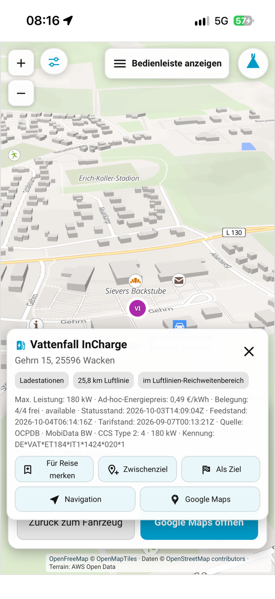

### Regionaler POI-Katalog

Über **Points of Interest → Regionaler POI-Katalog** können Anwender Länder und optional deutsche Bundesländer für einen lokalen OSM-POI-Katalog wählen. DriveLoom lädt regionale Geofabrik-PBF-Auszüge, importiert sie nacheinander in eigene SQLite-Dateien und aktualisiert sie zu einer eingestellten Uhrzeit im Abstand von **1 bis 30 Tagen**. Der Download zeigt übertragene Bytes und, falls bekannt, einen Fortschrittsbalken; die anschließende Datenbank-Importphase wird getrennt angezeigt. Fertige Kataloge bleiben während einer fehlgeschlagenen Aktualisierung erhalten.

Ausgewählte Regionen werden für Fahrzeugnähe und sichtbaren Kartenausschnitt abgefragt. Die einstellbare Obergrenze von **500 bis 10.000 Treffern pro Kartenabfrage** begrenzt die Darstellung, nicht den gespeicherten Katalog. Große Länder benötigen entsprechend Downloadzeit, Speicherplatz und Importzeit. Ein abgewählter Katalog kann in **Gespeicherte Kataloge** gezielt gelöscht werden. Der OSM-Katalog enthält keine Live-Belegung oder gesicherten aktuellen Ladepreise.

### Routen und Ziele

Die Routenansicht erlaubt einen Startpunkt vom Fahrzeug, vom Smartphone oder einem gewählten Ort, ein Ziel und Zwischenziele. Orte lassen sich suchen und globale Routenvorlagen speichern. Punkte auf der Karte oder POIs können als Start, Zwischenziel oder Ziel übernommen werden; für die eigentliche Navigation gibt es die Übergabe an eine externe Karten-App. Der POI-Standtest kann sich auf die Richtung zum vorhandenen Routenziel beziehen. Ein angezeigter POI „voraus“ ist dadurch **nicht automatisch entlang einer berechneten Straßenroute** geprüft.

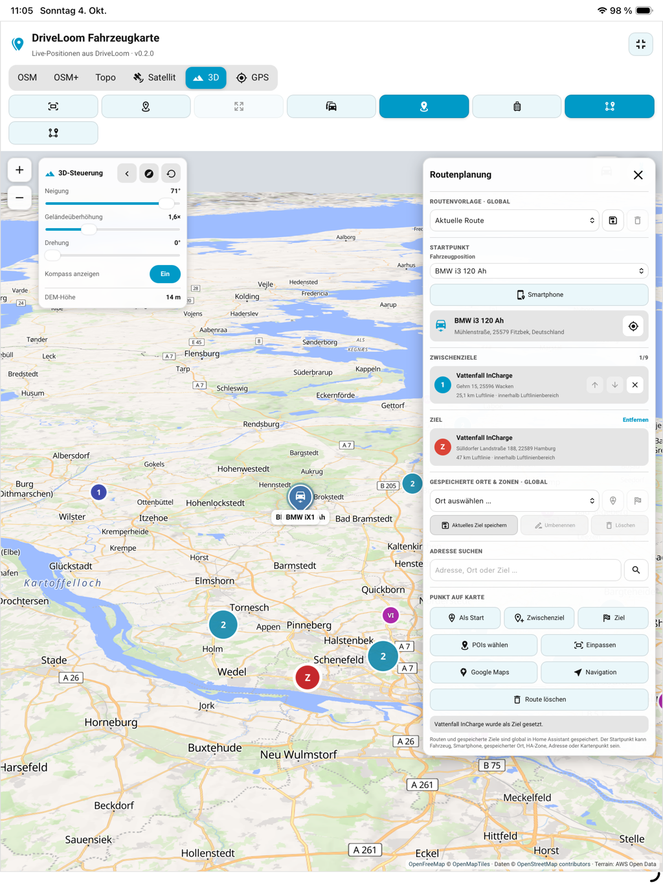

### Reisen (noch in der weiteren Entwicklung), eigene POIs und Dokumente

Unter **Reisen** legst du beliebig verschachtelte Ordner und Reiseordner an. Ordner können umbenannt, verschoben und mit Notizen versehen werden. Die Ordneransicht bietet Baum, Breadcrumbs und Bedienung per Maus oder Touch. Eigene Reise-POIs können aus bestehenden Karten-POIs, einer beliebigen Kartenposition, einer Orts-/Adresssuche oder eingefügten Koordinaten entstehen. Name, Adresse, Webseite, Farbe, Markerkürzel und Notizen sind bearbeitbar. Ein eigener POI kann mehreren Ordnern zugeordnet sein.

Du kannst nur die POIs eines Ordners samt optionalen Unterordnern oder **alle eigenen Reise-POIs** auf der Karte anzeigen. Bei der Ansicht aller eigenen POIs werden globale Vorlagen-POIs vorübergehend ausgeblendet. Für die Recherche innerhalb der Reiseansicht sind globale POI-Vorlagen ebenfalls verfügbar.

PDFs, Bilder, Office-Dateien und weitere Dokumente können in Ordner geladen und später verschoben werden. PDF, gängige Bilder und Text können je nach Browser zunächst angesehen werden; **Download ist eine gesonderte Aktion**. Office-Dateien benötigen für die Anzeige gegebenenfalls eine passende externe App. Der anfängliche Speicherrahmen beträgt **100 MiB pro Reise beziehungsweise oberstem Ordner** und ist anpassbar; es gibt keine gesonderte Größenoption pro Dokument. Reiseordner, eigene POIs, Notizen und Dokumente lassen sich als ZIP exportieren und in ein **leeres** Reisearchiv zurückspielen.

Die Suche versteht direkte Koordinaten wie `59.437, 24.753` und Google-Maps-Links mit eingebetteten Koordinaten. Eine ausdrücklich gestartete Orts-/Adresssuche verwendet den öffentlichen Photon-Dienst. Kurze Weiterleitungslinks ohne enthaltene Koordinaten werden nicht aufgelöst.

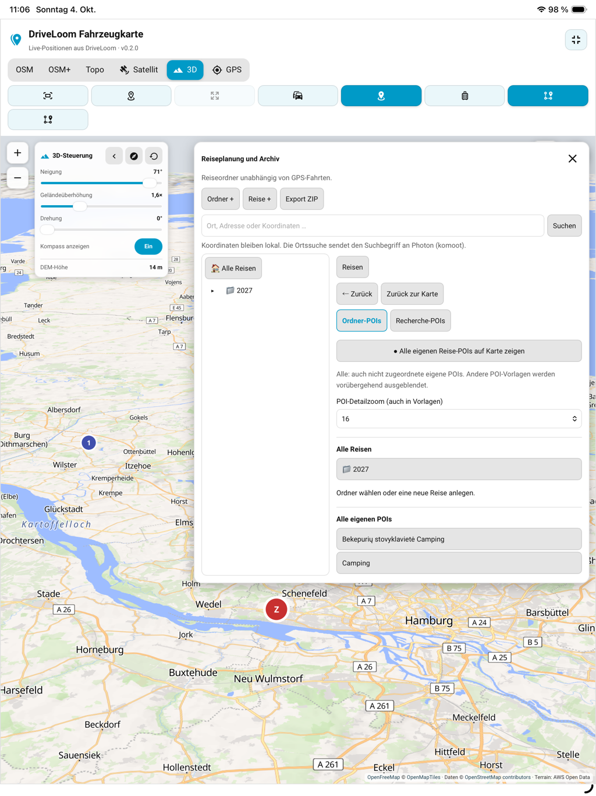

## Datenhaltung, externe Dienste und Sicherung

| Daten | Ablage und Hinweise |
| --- | --- |
| Fahrzeuge, Analysen, GPS-Punkte, Fahrten, Reise-Metadaten und Kartenpräferenzen | `<HA-Konfiguration>/.storage/driveloom.db` |
| Regionale OSM-Kataloge | Eigene `.storage/driveloom-pois-<Region>.db`-Dateien; ein kompletter Katalog kann nach Abwahl gelöscht werden |
| Hochgeladene Dokumentinhalte | `.storage/driveloom-documents.db`; Ordnerbeziehungen und Metadaten liegen in `driveloom.db` |
| OCPDB-Suchcache | `.storage/driveloom-ocpdb.db`; Belegungsdaten werden kürzer als Standort-/Tarifdaten verwendet |
| Home-Assistant-Konfiguration und Recorder | Werden von Home Assistant verwaltet und sind **nicht** Teil eines DriveLoom-Reise-ZIP-Exports |

Die allgemeine POI-Live-Suche nutzt OpenStreetMap-Daten, der regionale Katalog [Geofabrik](https://download.geofabrik.de/) und Ladestationen je nach Auswahl [Open Charge Map](https://openchargemap.org/) oder [MobiData BW/OCPDB](https://mobidata-bw.de/dataset/e-ladesaulen). Kartenstile und Kacheln können externe Kartendienste nutzen. Google Maps wird erst bei einer entsprechenden Navigation geöffnet. Eine ausdrücklich gestartete Adresssuche im Reisearchiv sendet den Suchbegriff an Photon; direkt eingegebene Koordinaten bleiben in Home Assistant.

Die Reise-ZIP-Sicherung enthält **keine** Fahrzeugtracks, regionalen Kataloge und HA-Einstellungen. Für die gesamte Installation weiterhin Home-Assistant-Backups verwenden. Eine laufende SQLite-Datei nicht einzeln kopieren: Schreibvorgänge können noch in SQLite-WAL-Dateien stehen.

## Projekt unterstützen

Wenn dir DriveLoom gefällt, kannst du die Weiterentwicklung freiwillig über [Ko-fi unterstützen](https://ko-fi.com/lemuba20013). DriveLoom ist natürlich auch ohne Spende nutzbar.

## Lizenz und Mitwirkung

Siehe [LICENSE](LICENSE). Fehlerberichte und konkrete Verbesserungsvorschläge sind unter [GitHub Issues](https://github.com/lemuba/DriveLoom/issues) willkommen.

---

## English

**DriveLoom brings Home Assistant vehicle data together with consumption analysis, GPS trips, and an interactive map.** On the same map, you can explore charging stations and other points of interest (POIs), plan destinations, and archive trips with notes and documents. The integration stores its data in Home Assistant.
The current version is **0.2.0**. DriveLoom includes a vehicle and consumption dashboard as well as a vehicle map for GPS, POIs, routes, and travel planning.

[☕ Support DriveLoom on Ko-fi](https://ko-fi.com/lemuba20013)


### Installation

#### Requirements

- Home Assistant **2026.1.0 or newer**.
- Existing Home Assistant sensors for **state of charge (SoC)** and **odometer** for each vehicle. Usable battery capacity is also required: as a sensor for the BMW profiles, or as a sensor or fixed value for the generic BEV profile.
- Optional: range, state of health (SoH), and GPS latitude/longitude. The two GPS sensors must be configured together.
- An **Open Charge Map** API key is required if that source is enabled. The key remains in the Home Assistant backend. **OCPDB · MobiData BW** does not require an Open Charge Map key.

#### HACS custom repository

1. Open **HACS**, select the three-dot menu, and choose **Custom repositories**.
2. Enter `https://github.com/lemuba/DriveLoom`, select **Integration** as the type, and add it.
3. Open **DriveLoom** in HACS and download the current version.
4. **Restart Home Assistant**. Go to **Settings → Devices & services → Add integration**, search for **DriveLoom**, and set up a vehicle.

HACS manages the integration files. In Lovelace storage mode, DriveLoom registers its dashboard resource automatically at startup. YAML resource mode requires the additional entry shown below. General guidance: [HACS – Custom Repositories](https://www.hacs.dev/docs/faq/custom_repositories/).

#### Manual installation

1. Copy the entire `custom_components/driveloom` directory to `<HA configuration directory>/custom_components/driveloom`. Keep the subdirectories, including `frontend/`, `brand/`, and `translations/`.
2. When updating, copy all files from the new version. Remove old versioned `driveloom-card-*.js` files from the destination if they do not belong to the installed version.
3. Restart Home Assistant and add **DriveLoom** under **Settings → Devices & services** as described above.

#### Set up a vehicle and dashboard

First select **BEV**. Then assign a name, SoC sensor, and odometer sensor. With BMW profiles, provide the sensor for the high-voltage battery's **total usable capacity**, not its current energy content. For BEV, you can instead enter a fixed usable capacity in kWh. Range, SoH, and GPS sensors are optional depending on the vehicle profile. Add more vehicles through **Add device**; existing vehicles can be reconfigured later.


<details><summary>Example: assigning vehicle sensors</summary>


</details>

Next, add a **Manual card** to a dashboard with one of these configurations:

```yaml
type: custom:driveloom-card
```

```yaml
type: custom:driveloom-map-card
```

If you use Lovelace **YAML resource mode**, also add this JavaScript module resource:

```yaml
resources:
  - url: /driveloom/driveloom-card-0.2.0.js?v=0.2.0
    type: module
```

After an update, reload the dashboard page. If it still shows an older version, check the browser or app cache and the resource path.

### Features

#### Vehicle dashboard and consumption

The dashboard shows vehicle status, SoC, range, odometer, and capacity, plus consumption and distance for today, this week, this month, this year, and a custom period. A shared date range lets you compare vehicles. Trip and consumption analysis uses data stored by DriveLoom; missing values are not treated as measured zeroes. Tools for checking and repairing SoC data are accessible from the dashboard.

#### Vehicle map and map controls

The map displays multiple vehicles with markers that can be shown or hidden, and their range where available. Choose among **OSM, OSM+, Topo, Satellite, and 3D**. The 3D view offers controls including pitch, rotation, and terrain elevation. **GPS Follow** keeps the selected vehicle in view and can rotate the direction of travel to the top after consecutive reliable position updates. A driving view hides the upper control bar to give the map more room.


The map restores its position, zoom, and open POI panel after switching apps or rebuilding the card. When GPS Follow is active, the vehicle camera takes precedence. An open POI popup is not reopened automatically after a full reload.

#### GPS recording and trips

Under **Tracking/GPS History**, you can enable recording for each vehicle, choose periods and display options, organize trips in folders, and inspect tracks on the map. The view includes colored speed segments, a legend, trip selection, GPX export, playback, and manual import of older GPS data from the Home Assistant Recorder. Trips can be edited individually or in batches.

In addition to configured vehicle sensors, **external GPS sources** are supported, such as a position from the iPhone Companion app. Trips can be started manually. Alternatively, each vehicle can use an automatic trigger:

- an existing sensor reporting a particular Wi-Fi/CarPlay **SSID**; or
- an existing Home Assistant `binary_sensor.*` entity, with `on` meaning connected and `off` meaning disconnected.

A disconnection pauses the automatic trip; it can resume after reconnection. A longer disconnection ends it. An unknown or unavailable binary sensor is treated as disconnected. Optionally, DriveLoom can request location updates from the iPhone Companion app during an active trip. DriveLoom **does not create the binary sensor itself**. Previously saved SSID rules remain usable.


<details><summary>More: recorded route and trip list</summary>


</details>

#### POI search, filters, and presets

In the POI panel, you can combine categories and search terms for general POIs with separate charging-station filters. The search center can be the **current vehicle** or the **map center**. Filters and search radius can be saved in global POI presets. POI markers are clustered on the map and shown individually as you zoom in.


<details><summary>Choose presets on a smartphone</summary>


</details>

With **GPS Follow**, an optional panel shows **one to three POIs ahead** from the loaded and filtered results. You can switch presets directly in the panel. Arrows, double arrows, swiping, the mouse wheel, and a position slider browse additional results. Tapping a POI centers it at the configurable detail zoom; you can then return to the vehicle view or hand navigation over to Google Maps. The **Test POI ahead** control displays the selection while stationary. Distances shown are straight-line distances, not road distances.


<details><summary>More mobile views: switching presets and previewing a POI</summary>


</details>

#### Charging stations, prices, and availability

For charging points, choose between **Open Charge Map** and **OCPDB · MobiData BW (Germany)**. Depending on the source, filters include operator, connector type, minimum power, known ad hoc price, maximum price per kWh, and minimum number of available charging points. These settings can be part of a global POI preset and also apply to POIs in GPS Follow.


DriveLoom displays OCPDB prices only when a readable tariff can be associated with the relevant connector and charging point. Additional time-based fees are identified separately. Stale or missing status reports count as **unknown**, not available. A charging-point popup separates available operator and station links. **Check the price, status, and additional fees with the operator or at the charging point before charging.**


#### Regional POI catalog

Under **Points of Interest → Regional POI Catalog**, users can select countries and optionally German federal states for a local OSM POI catalog. DriveLoom downloads regional Geofabrik PBF extracts, imports them one at a time into separate SQLite files, and refreshes them at a chosen time every **1 to 30 days**. The download displays transferred bytes and a progress bar where the total is known; database import progress is shown separately. Completed catalogs remain available if an update fails.

Selected regions are queried near the vehicle and within the visible map area. The configurable limit of **500 to 10,000 results per map query** restricts the display, not the stored catalog. Large countries require corresponding download time, disk space, and import time. After deselecting a catalog, you can delete it explicitly under **Stored catalogs**. The OSM catalog does not contain live occupancy or guaranteed current charging prices.

#### Routes and destinations

The route view can use the vehicle, smartphone, or a selected place as the starting point, with a destination and intermediate stops. You can search for places and save global route presets. Map points or POIs can be used as the start, a stop, or the destination; navigation itself is handed over to an external maps app. The stationary POI test can use the direction toward an existing route destination. A POI shown as “ahead” is therefore **not necessarily checked against a calculated road route**.


#### Travel (still in development), personal POIs, and documents

Under **Travel**, you can create nested folders and trip folders at any depth. Folders can be renamed, moved, and annotated. The folder view offers a tree, breadcrumbs, and mouse or touch controls. You can create personal trip POIs from existing map POIs, any map position, a place/address search, or pasted coordinates. Name, address, website, color, marker abbreviation, and notes are editable. A personal POI can belong to several folders.

You can show only the POIs of one folder, optionally including its subfolders, or **all personal trip POIs** on the map. When all personal POIs are displayed, POIs from global presets are temporarily hidden. Global POI presets are also available for research within the Travel view.

PDFs, images, Office files, and other documents can be uploaded to folders and moved later. Depending on the browser, PDFs, common images, and text can first be previewed; **download is a separate action**. Office files may require a suitable external app for viewing. The initial storage allowance is **100 MiB per trip or top-level folder** and can be adjusted; there is no separate per-document size setting. Trip folders, personal POIs, notes, and documents can be exported as a ZIP and restored into an **empty** travel archive.

The search accepts direct coordinates such as `59.437, 24.753` and Google Maps links containing coordinates. An explicitly initiated place/address search uses the public Photon service. Short redirect links without embedded coordinates are not resolved.


### Data storage, external services, and backups

| Data | Storage and notes |
| --- | --- |
| Vehicles, analyses, GPS points, trips, travel metadata, and map preferences | `<HA configuration>/.storage/driveloom.db` |
| Regional OSM catalogs | Separate `.storage/driveloom-pois-<Region>.db` files; an entire catalog can be deleted after deselection |
| Uploaded document contents | `.storage/driveloom-documents.db`; folder relationships and metadata are stored in `driveloom.db` |
| OCPDB search cache | `.storage/driveloom-ocpdb.db`; occupancy data is retained for less time than location/tariff data |
| Home Assistant configuration and Recorder | Managed by Home Assistant and **not** included in a DriveLoom travel ZIP export |

General live POI search uses OpenStreetMap data, the regional catalog uses [Geofabrik](https://download.geofabrik.de/), and charging stations use [Open Charge Map](https://openchargemap.org/) or [MobiData BW/OCPDB](https://mobidata-bw.de/dataset/e-ladesaulen/), depending on your selection. Map styles and tiles may use external map services. Google Maps opens only when you choose the corresponding navigation action. An explicitly started address search in the travel archive sends the query to Photon; coordinates entered directly stay within Home Assistant.

The travel ZIP backup does **not** contain vehicle tracks, regional catalogs, or Home Assistant settings. Continue using Home Assistant backups for the full installation. Do not copy an active SQLite database file on its own: pending writes may still be in SQLite WAL files.

### Support the project

If you like DriveLoom, you can [support its development on Ko-fi](https://ko-fi.com/lemuba20013). Donations are optional; DriveLoom works without them.

### License and contributions

See [LICENSE](LICENSE). Bug reports and specific suggestions for improvements are welcome through [GitHub Issues](https://github.com/lemuba/DriveLoom/issues).
